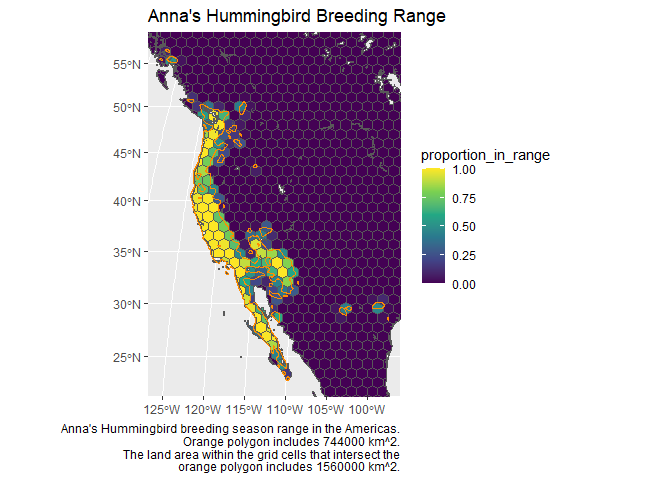
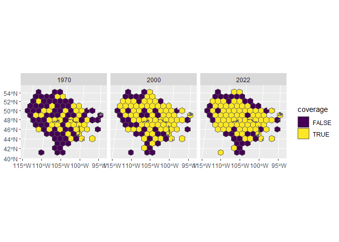
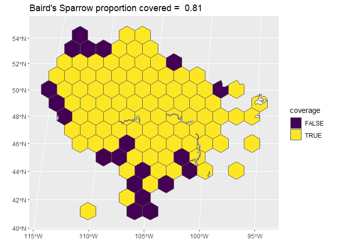
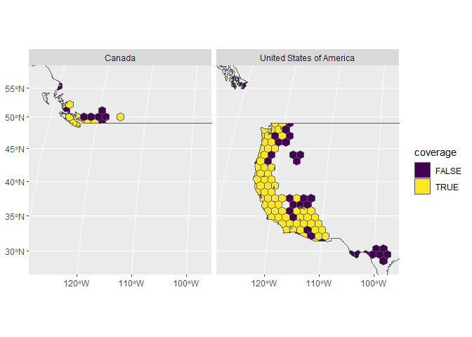

<!-- README.md is generated from README.Rmd. Please edit that file -->

# SurveyCoverage

<!-- badges: start -->
<!-- badges: end -->

The goal of SurveyCoverage is to provide some common tools to assess the
spatial coverage of long-term land-bird monitoring programs. Here the
“coverage” of a monitoring program is defined as an approximate
proportion of the species’ range that is within the region sampled by a
given monitoring program. The metrics here are approximations and
provide only one example of a potential approach.

Measuring the proportion of a species’ range that is covered by
monitoring helps to understand the potential for bias in estimates of
that species’ population status and trend. A species’ status can vary
across its range due to variation in factors that affect its status,
such as human activity, landcover-change, interactions with other
species, and climate. If our monitoring data are derived exclusively
from a portion of that range, estimates may not reflect the species’
trends and status in the un-monitored portion.

Our overall goal is to provide simple tools that can be applied across
many monitoring programs to support a coarse metric of reliability and
potential bias in the trend estimates.

## Installation

You can install SurveyCoverage from [GitHub](https://github.com/) with:

``` r
if (!requireNamespace("remotes", quietly = TRUE)) {
  install.packages("remotes")
}
remotes::install_github(AdamCSmithCWS/SurveyCoverage")
```

### Required additional package

SurveyCoverage currently requires the package
[ebirdst](https://github.com/ebird/ebirdst)

``` r
remotes::install_github("ebird/ebirdst")
```

#### ebirdst Access Request - Necessary for use of SurveyCoverage package

Data access to download ebirdst content is granted through an Access
Request Form at: <https://ebird.org/st/request>. Access with this form
generates a key to be used with this R package and is provided
immediately (as long as commercial use is not requested).

After completing the Access Request Form, you will be provided a Status
and Trends Data Products access key, which you will need when
downloading data. To store the key so the package can access it when
downloading data, use the function `set_ebirdst_access_key("XXXXX")`,
where `"XXXXX"` is the access key provided to you.

## Workflow Overview

The package consists of three primary functions:

1.  `grid_range()` - applies a regular grid to a species seasonal range
    map. Downloads ebirdst range map for a given species.

2.  `overlay_range_data()` - overlays the gridded range map information
    from `grid_range()` with spatial (and optionally annual) monitoring
    data from a given program to calculate the proportion of the species
    range (overall and/or annual) within grid cells that have monitoring
    data.

3.  `regional_summary()` - conducts a spatial join of a regional map
    with the coverage maps from the previous function, to summarise
    coverage within those regions.

## Example

This is a basic example which shows you how to assess the coverage of
the North American Breeding Bird Survey (BBS) of Baird’s Sparrow. The
BBS survey data for Baird’s Sparrow are supplied with the package. These
example data are the survey event information for all surveys on BBS
routes where the species has been observed at least once since 1966 -
essentially, the survey events that would be included in a standard
trend analysis of the BBS for this particular species. These survey data
will be used in the second step of the example.

### Download and apply a regular grid to the species’ ebird range map

The package allows the user to download a range map using `ebirdst`,
then to stratify that range map based on an equal area, regular grid.

``` r
library(SurveyCoverage)
library(tidyverse)
#> ── Attaching core tidyverse packages ──────────────────────── tidyverse 2.0.0 ──
#> ✔ dplyr     1.1.4     ✔ readr     2.1.5
#> ✔ forcats   1.0.0     ✔ stringr   1.5.1
#> ✔ ggplot2   3.5.0     ✔ tibble    3.2.1
#> ✔ lubridate 1.9.3     ✔ tidyr     1.3.1
#> ✔ purrr     1.0.2     
#> ── Conflicts ────────────────────────────────────────── tidyverse_conflicts() ──
#> ✖ dplyr::filter() masks stats::filter()
#> ✖ dplyr::lag()    masks stats::lag()
#> ℹ Use the conflicted package (<http://conflicted.r-lib.org/>) to force all conflicts to become errors

example_species <- "Baird's Sparrow"

range_info <- grid_range(example_species)
#> Downloading ebirdst range data for Baird's Sparrow baispa
#> Downloading Status Data Products for baispa
#> Data already exists, use force = TRUE to re-download.
#> cropping range map to the Western Hemisphere
#> intersecting range map and coverage grid
#> recalculating land area of grid cells inside range
# will fail if ebirdst access key was not successfully set-up (see above).
```

The output of `grid_range()` is a large list that includes the following
objects:

1.  coverage_grid - a map representing the species’ eBird range map
    intersected with a regular grid. A simple feature `sf` polygon
    object of the regular grid applied to the range map. The attributes
    will include at least these four columns: a unique name for each
    grid cell (grid_cell_name), the land area of the grid cell in
    squared kilometers (area_km2), the land area of the grid cell that
    is covered by the species’ range (area_km2_inrange), the proportion
    of the grid cell’s land area covered by the species’ range
    (proportion_in_range).

2.  range_map - a map. A simple feature `sf` polygon object that
    represents the downloaded eBird range map for the selected season.

3.  range_area - numeric. The total land area within the species’ eBird
    range map.

4.  range_area_gridded - numeric. The total land area of grid cells that
    intersect with the species’ eBird range map (ignoring the portions
    of grid cells that are outside of the mapped range boundary)

``` r
range_map <- range_info[["range_map"]]
grid <- range_info[["coverage_grid"]]
focus <- sf::st_bbox(range_map)
map <- ggplot()+
  geom_sf(data = grid,
          aes(fill = proportion_in_range))+
  geom_sf(data = range_map,
          colour = "darkorange",
          fill = NA)+
  coord_sf(xlim = focus[c("xmin","xmax")],
           ylim = focus[c("ymin","ymax")])+
  scale_fill_viridis_c()+
  labs(title = paste(example_species,"Breeding Range"),
       caption = paste(example_species,"breeding season range in the Americas.
                       Orange polygon includes",signif(range_info[["range_area"]],3),
                       "km^2.
                       The land area within the grid cells that intersect the
                       orange polygon includes", signif(range_info[["range_area_gridded"]],3),"km^2."))
print(map)
```



### Overlaying the survey data with the gridded range

The package accepts two different kinds of input to represent the survey
information:

1.  Dataframe of survey site names and coordinates. If the survey
    locations can be reliably represented as points, then at a minimum,
    the package requires a dataframe with three columns: 1- a unique
    name for each survey site; 2- the longitude coordinate for each
    site; and 3- the latitude coordinate for each site. The coordinates
    should be in decimal degrees WGS 84 format for the package defaults
    to work.

2.  Map of survey sites in a simple features `sf` object. Can represent
    POINTS, POLYGONS, or LINEAR features (or even a mixture of these).
    The map layer must have a defined coordinate reference system.

Either of these input types can optionally include an attribute (column)
representing the year surveys were conducted at each site. If a year
column is included, then the package calculates both annual coverage as
well as the overall coverage.

#### Coverage of Baird’s Sparrow by the BBS

The package includes an example survey dataset representing the BBS
survey data for Baird’s Sparrow.

``` r
 basp <- SurveyCoverage::example_basp_bbs_data
 str(basp)
#> tibble [5,490 × 5] (S3: tbl_df/tbl/data.frame)
#>  $ english  : chr [1:5490] "Baird's Sparrow" "Baird's Sparrow" "Baird's Sparrow" "Baird's Sparrow" ...
#>  $ year     : num [1:5490] 2006 2007 2008 2009 2010 ...
#>  $ route    : chr [1:5490] "4-404" "4-404" "4-404" "4-404" ...
#>  $ longitude: num [1:5490] -114 -114 -114 -114 -114 ...
#>  $ latitude : num [1:5490] 49.9 49.9 49.9 49.9 49.9 ...
```

These data are the start coordinates, route name, and year of every BBS
survey that would be included in an analysis of the species’ trend
(surveys on routes at which the species has been observed at some point
between 1966 and 2022).

``` r
basp_coverage <- overlay_range_data(range = range_info,
                                   survey_sites = basp,
                                   sites = "route",
                                   years = "year",
                                   x_coord = "longitude",
                                   y_coord = "latitude",
                                   crs_site_coordinates = 4326,
                                   add_survey_sites_to_range = TRUE)
#> input survey_sites is data frame. Creating spatial POINTS
#>                     using coordinates provided in arguments x_coord and y_coord.
#>                     Please ensure that the coordinates are latitude and longitude
#>                     decimal degrees with coordinate reference system WGS 84,
#>                     or that the correct coordinate reference system was provided
#>                     to the argument crs_site_coordinates
#> Performing spatial join with range, this may take 5-10 minutes...
#> Reconciling range area to include grid cells with
#>           data outside of species' seasonal range
```

The output from the `overlay_range_data()` function is a list with five
objects.

1.  coverage_map - map of the cells in the species’ range that intersect
    the survey data in each year. If a year column was included with the
    input data, then this mapped information is repeated for each year
    of the data. If no year information was included, then this object
    will be identical to the cumulative_coverage_map

2.  cumulative_coverage_map - map of cells in the species’ range that
    intersect survey data in at least 1 year (if default value of
    minimum_n_years was used).

3.  total_gridded_range_area - land area of gridded range.

4.  annual_coverage_estimate - dataframe of area and proportion of range
    covered in each year

5.  cumulative_coverage_estimate = dataframe (1-row) of area and
    proportion of range covered.

``` r
coverage_map <- basp_coverage$coverage_map

coverage_selected <- coverage_map %>% 
  filter(year %in% c(1970,2000,2022))
  
coverage_by_selected_years <- ggplot()+
  geom_sf(data = coverage_selected,
          aes(fill = coverage))+
  scale_fill_viridis_d()+
  facet_wrap(vars(year))
    
print(coverage_by_selected_years)
```



``` r

cumulative_coverage_map <- basp_coverage$cumulative_coverage_map
overall_coverage_estimate <- basp_coverage$cumulative_coverage_estimate

coverage_overall <- ggplot()+
  geom_sf(data = cumulative_coverage_map,
          aes(fill = coverage))+
  scale_fill_viridis_d()+
  labs(title = paste(example_species,"proportion covered = ",round(overall_coverage_estimate$coverage_proportion,2)))
    
print(coverage_overall)
```



### Regional Summaries

To summarise Baird’s Sparrow coverage in the United States and Canada,
the `regional_summary()` function requires the output of the previous
function and a map of the two countries (polygons).

``` r

national_map <- bbsBayes2::load_map(stratify_by = "prov_state")
# The prov_state map in bbsBayes2 includes a country column indicator.

national_summary <- regional_summary(coverage = basp_coverage,
                                     regions = national_map,
                                     region_name = "country")
#> joining annual coverage map with regions


Canada_proportion_covered <- national_summary$regional_cumulative_coverage_estimate %>% 
  filter(coverage == TRUE,
         summary_region == "Canada") %>% 
  select(proportion_of_region) %>% 
  unlist()
  
US_proportion_covered <- national_summary$regional_cumulative_coverage_estimate %>% 
  filter(coverage == TRUE,
         summary_region == "United States of America") %>% 
  select(proportion_of_region) %>% 
  unlist()
  
```

The output from the `regional_summary()` function is also a five object
list, and the objects are very similar to the output from the
`overlay_range_data()` function.

1.  regional_coverage_map - map of the annual coverage grid that
    includes an indicator of which region the grid cell is allocated to
    (based on spatial join).

2.  regional_cumulative_coverage_map - map of the cumulative coverage
    grid that includes an indicator column for region.

3.  regional_map - a map of the polygons used to define the regions.

4.  regional_annual_coverage_estimate - dataframe of area and proportion
    of range covered in each year plus an additional column indicating
    which region each grid cell belongs to.

5.  regional_cumulative_coverage_estimate - dataframe of area and
    proportion of range covered by region.

Our example here suggests that the BBS covers approximately 83% of the
species range in Canada, and 80% of the species range in the United
States.

``` r

regional_cumulative_coverage_map <- national_summary$regional_cumulative_coverage_map
regional_map <- national_summary$regional_map


focus <- sf::st_bbox(regional_cumulative_coverage_map)

country_map <- ggplot()+
  geom_sf(data = regional_cumulative_coverage_map,
          aes(fill = coverage))+
  geom_sf(data = regional_map,
          fill = NA)+
  scale_fill_viridis_d()+
  coord_sf(xlim = focus[c("xmin","xmax")],
           ylim = focus[c("ymin","ymax")])+
  facet_wrap(vars(summary_region))

print(country_map)
```


